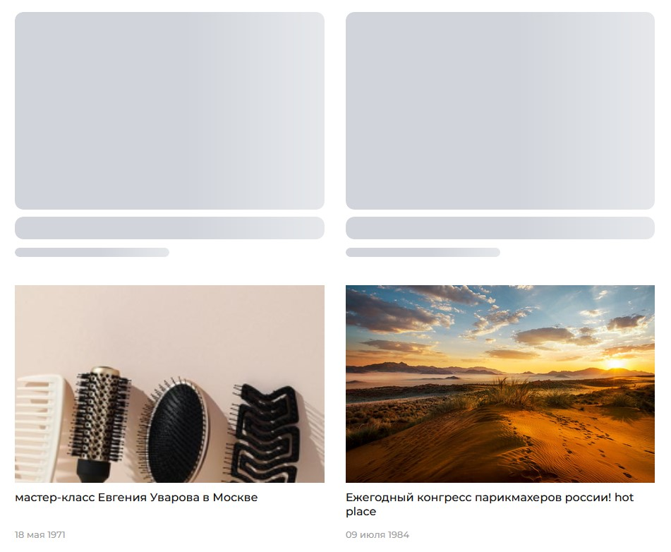

# Skeleton (иллюзия быстрой загрузки страниц)

## Введение ##

При отображении статуса загрузки страницы, в основном существует два способа: 
- графики загрузки
- индикаторы выполнения

Но, все больше и больше приложений используют метод «скелетного экрана» для отображения выгруженного контента, предоставляя пользователям совершенно новый опыт.

**Скелетный экран (в качестве экрана заставки) используется, чтобы дать понять пользователю, что страница загружается.\
В сравнении с пустым экраном и спиннером он создаёт иллюзию более быстрой загрузки страниц.**

*Рекомендую почитать отличное [исследование](https://uxdesign.cc/what-you-should-know-about-skeleton-screens-a820c45a571a) продуктового дизайнера компании Clio Билла Чанга.
[Перевод исследования](https://vc.ru/design/59939-dlya-illyuzii-bystroy-zagruzki-stranic-pravila-sozdaniya-skeletnogo-ekrana-na-saytah-i-v-prilozheniyah)*

## Существующие реализации ##

Все основные "монстры" в своем "боекомплекте" уже содержат компоненты для построения Skeleton
[Vuetify](https://vuetifyjs.com/en/components/skeleton-loaders/), [vue-bootstrap](https://bootstrap-vue.org/docs/components/skeleton), [Framework7](https://framework7.io/vue/skeleton), [Quasar](https://quasar.dev/vue-components/skeleton) и т.д.

Также есть множество отдельных пакетов: [Skeleton Elements](https://skeleton-elements.dev/vue/), [vue-loading-skeleton](https://github.com/kitwon/vue-loading-skeleton), [vue-skeleton-loading](https://github.com.cnpmjs.org/jiingwang/vue-skeleton-loading), ... и еще штук 30 

Почти все реализации предполагают: 
1. Создание дополнительных компонент или же верстка непосредственно в шаблоне скилетона (ов)
2. Построение скилетона с использованием входящих в пакет собственных компонентов, типовые примеры:
   
[vue-bootstrap](https://bootstrap-vue.org/docs/components/skeleton)
```vue
 <b-skeleton-wrapper :loading="loading">
    <template #loading>
        <b-card>
          <b-skeleton width="85%"></b-skeleton>
          <b-skeleton width="55%"></b-skeleton>
          <b-skeleton width="70%"></b-skeleton>
        </b-card>
    </template>
    <b-card>
        turpis egestas. Phasellus at consequat dui. Aenean tristique sagittis quam,
        sit amet sollicitudin neque sodales in.
    </b-card>
</b-skeleton-wrapper>
```


[Vuetify](https://vuetifyjs.com/en/components/skeleton-loaders/)
```vue
<v-col cols="12" md="4">
    <v-skeleton-loader v-bind="attrs" type="list-item-avatar, divider, list-item-three-line, card-heading, image, actions">
    </v-skeleton-loader>
    <v-skeleton-loader v-bind="attrs" type="list-item-avatar-three-line, image, article">
    </v-skeleton-loader>
</v-col>
```

[vue-loading-skeleton](https://github.com/kitwon/vue-loading-skeleton)
```vue
<div class="item">
  <div class="item__photo">
    <PuSkeleton circle height="50px">
      {{ props.data.img }}
    </PuSkeleton>
  </div>
  <div class="item__meta">
    <div class="item__title">
      <PuSkeleton>{{ props.data.title }}</PuSkeleton>
    </div>
    <div class="item__info">
      <PuSkeleton :count="2">{{ props.data.body }}</PuSkeleton>
    </div>
  </div>
</div>
```

## Будем делать проще !!! ##

1. В конце концов применение всех вышеуказанных пакетов сводится к тому,\
   что  у нас на время загрузки (или иного ивента) в разметке присутствует "магический" плавно играющий блок, элементы которого\
   почти в точности повторяют по высоте и ширине, а также отступам и полям основной "настоящий" блок  



2. Используем утилитарные классы либо [Bootstrap](https://getbootstrap.com/docs/5.1/utilities/api/) (Гусары молчать!), а лучше (ИМНО)/
   [TailwindCSS/](https://tailwindcss.com/)
3. Вопрос. Сколько времени нужно потратить чтобы сделать разметку на утилитарных классах почти любого "скелета"...,\
   а сколько "секса" нужно чтобы настроить все эти вышеуказанные компоненты...

**Погнали !**

### Стили
```css
.skeleton {
  position: relative;
  display: block;
  user-select: none;
  overflow: hidden;
  background: #d1d5db;
  border-radius: 12px;

  &--wave {
    position: relative;
    overflow: hidden;
    -webkit-mask-image: -webkit-radial-gradient(white, black);
    &::after {
      content: "";
      position: absolute;
      bottom: 0;
      left: 0;
      right: 0;
      top: 0;

      animation: wave 1.5s linear 0s infinite;
      background: linear-gradient(90deg, transparent, rgba(255, 255, 255, 0.5), transparent);
      transform: translate3d(-100%, 0, 0);
      will-change: transform;
    }
  }
}

@keyframes wave {
  0% {
    transform: translate3d(-100%, 0, 0);
  }
  60% {
    transform: translate3d(100%, 0, 0);
  }
  100% {
    transform: translate3d(100%, 0, 0);
  }
}
```

### Базовые компоненты ...
**А их нет!**

Просто делаем компонент-разметку, например,
```vue
<template>
  <transition-group name="skeleton" mode="out-in">
    <div :key="1" class="skeleton skeleton--wave h-223" />
    <div :key="2" class="mt-16 flex items-center justify-between">
      <div class="skeleton skeleton--wave w-220 h-14"></div>
      <div class="skeleton skeleton--wave h-16 w-80"></div>
    </div>
    <div :key="3" class="skeleton skeleton--wave h-22 mt-12"></div>
    <div :key="4" class="skeleton skeleton--wave w-100 mt-12 h-14"></div>
  </transition-group>
</template>
```

или, например, с уже существующими классами для "живого" реального компонента
```vue
<template>
  <transition name="skeleton" mode="out-in">
    <div class="article-smallitem">
      <div class="skeleton skeleton--wave article-smallitem__preview">
        <div class="article-smallitem__preview-img h-200 w-400"></div>
      </div>
      <div class="article-smallitem__header py-10">
        <div class="skeleton skeleton--wave h-20 w-full"></div>
      </div>
      <div class="article-smallitem__stat-info mt-6">
        <div class="article-smallitem__date">
          <div class="skeleton skeleton--wave h-13 w-130"></div>
        </div>
      </div>
    </div>
  </transition>
</template>
```


**Основной принцип (типовой):**

1. Размечаем планировочную блочную структуру
2. Для элементов - "костей" указываем стили  `skeleton skeleton--wave`
::: tip Анимация !!!
Как видно выше из основного стиля скелетона, можно дополнить иные виды анимации на замену `skeleton--wave`
:::
3. Основной момент! "Кости" у нас - это просто `<div></div>`. Им необходимо придать примерные очертания, а именно:\
   выставить ширину и высоту (по прототипу реального компонента) 
```vue
<!-- h-200 w-400 -->
<div class="article-smallitem__preview-img h-200 w-400"></div>
```

## Пример использования ##

>Разметка скелетонов показана выше

Пока производится загрузка данных в хуке ``fetch`` (``$fetchState.pending``) - отображем скелетон, а после скрываем его и отображаем реальный компонент

```vue{3,4,5}
<template>
  <main class="page-wrapper">
    <div v-show="$fetchState.pending" class="container">
      <SkeletonTrainingPage></SkeletonTrainingPage>
    </div>
    <section class="container-fluid relative min-h-[max-content] overflow-hidden">
    ...
```

Пример использования скелетона при подгрузке данных (вместо надоевшего спиннера)

```vue{10-14}
<template>
  <main class="page-wrapper container">
    <BreadCrumbs />
    <h1>Новости</h1>

    <section class="news-list-wrapper mt-40">
      <NewsItem v-for="iter in newsList" :key="iter.id" :article-model="iter"> </NewsItem>
    </section>

    <InfiniteScroll class="news-list-wrapper mt-0" @on-intersect="loadMore()">
      <template v-if="loading">
        <SkeletonNewsItem v-for="index in 6" :key="index"> </SkeletonNewsItem>
      </template>
    </InfiniteScroll>
  </main>
</template>
```


::: tip client-only
Если заменяемый компонент клиент-онли, то необходимо внимательно проверить режимы `SPA` и `SSR` ,\
возможно в условии рендеринга скелетона необходимо учитывать `process.client`
:::

```vue{3}
<template>
  <main class="page-wrapper">
    <MainPageTopBannerSkeleton v-show="!isLoaded"></MainPageTopBannerSkeleton>
    <MainPageTopBanner v-show="isLoaded" :model="model"></MainPageTopBanner>
  </main>
</template>
```

```ts
get isLoaded() {
  return process.client && !!this.model && this.model.loaded;
}
```

