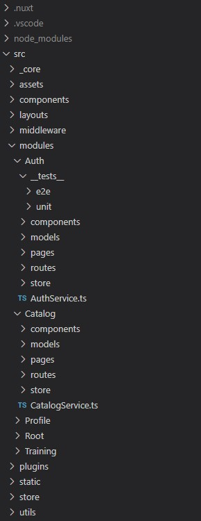
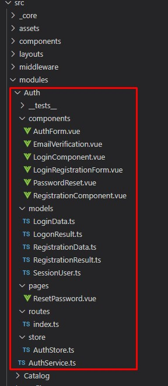

# Структура папок (DDD) #

[[toc]]

## Введение ##

::: tip ВНИМАНИЕ !
1. Организация структуры папок проекта по модульному принципу - это НЕ моя "больная" фантазия.\
   Данный подход "выстрадан" на реальных проектах (многие даже в продакшн :)).\
   Также ниже несколько ссылок (даже доклад с [Nuxt Nation 2021 Lightning talk](https://www.youtube.com/watch?v=lwXbBlx01a4)), где обсуждаются плюсы данного подхода
2. Не стоит питать иллюзий. На фронте мы **никогда** (!!!) не добьемся идеальной изолированности сущностей,\
   артефакты одного модуля будут использовать и/или зависеть от "сторонних" (из других модулей).
3. Создать "идеальный", абсолютно самостоятельный модуль - это НЕ **самоцель**!
4. Преследуя цель реализовать "самостоятельный" изолированный модуль, НЕ стоит пытаться организовывать общие модули и "выносить" какие-то артефакты в них.\
   Это "убьет" основную цель - `просто сделать чуть-чуть, малость удобнее и продуктивнее кодинг`           
:::

**Ссылки**

[Nuxt Nation 2021 Lightning talk: Domain Driven Design & Nuxt by Anton Reindl](https://www.youtube.com/watch?v=lwXbBlx01a4)\
[Domain-Driven Design in Nuxt Apps](https://vueschool.io/articles/vuejs-tutorials/domain-driven-design-in-nuxt-apps/)\
[Required Style Guide used by Basicamente](https://gist.github.com/plinionaves/1e619a414602cd535c6b73a035ae2f75)\
[Domain-Driven Design With React ](https://css-tricks.com/domain-driven-design-with-react/)\
[Migrating our VueJS Frontend to Domain Driven Design](https://medium.com/penngineering/migrating-our-vuejs-frontend-to-domain-driven-design-d7967865eb4d)\
[Domain-Driven Design in Vue.js](https://vueschool.io/articles/vuejs-tutorials/domain-driven-design-in-vue-js/)


**"Классический"** подход организации папок в проекте предполагает группирование по *функциональному* признаку (техническому), страницы отдельно, компоненты отдельно и т.д."

**"Модульный"** подход предлагает сосредоточиться на *логическом* группировании элементов, то есть с точки зрения функционального *использования*, а не функционального *назначения*.\

Похожая аргументация (одним из аргументов) была и при реализации Composition API 
[Почему появился Composition API?](https://v3.ru.vuejs.org/ru/guide/composition-api-introduction.html#%D0%BF%D0%BE%D1%87%D0%B5%D0%BC%D1%83-%D0%BF%D0%BE%D1%8F%D0%B2%D0%B8%D0%BB%D1%81%D1%8F-composition-api) , цитата:
> "*...Разделение по опциям делает менее заметными логические блоки используемые в них. Кроме того, при работе над одной логической задачей приходится постоянно «прыгать» между блоками в поисках соответствующего кода. Было бы удобнее, если соответствующий логическому блоку код можно разместить рядом. И это именно то, чего позволяет добиться Composition API...*"

**ИТОГО**:

1. Проект, организованный по модульному принципу, лучше читается, что делает его более лёгким для понимания. 
2. Также "банально" повышает производительность кодинга, позволяя не "прыгать" между множеством папок, а "находиться" в своем текущем модуле-папке 

## Модульный подход ##

**Пример огранизации папок** в реальном проекте



1. В `src` папка `modules`, в которой расположены подпапки логических модулей
2. Структура папок `модуля`:
   - `__tests__` - unit, e2e тесты
   - `components` - vue-компоненты
   - `models` - модели (описание сущностей), как хотите DTO, ViewModel и т.д.
   - `pages` - vue-страницы
   - `routes` - определение маршрутов (vue-router) 
   - `store` - определение Vuex-модулей
   - в корне - сервисы. Обычно их не так много в рамках модуля, смысла делать папку нет

**Пример модуля**



### Папка `routes` ###
Должен быть один файл `index.ts` в котором экспорт (default) массива маршрутов (в дальнейшем будет их авторегистрация)
```ts
// index.ts

const routes = [
  {
    name: "training",
    path: "/training",
    component: () => lazyLoad(import("@/modules/Training/pages/TrainingListPage.vue")),
  },

  {
    name: "training-arenda-card",
    path: "/training/arenda",
    props: true,
    component: () => lazyLoad(import("@/modules/Training/pages/ArendaPage.vue")),
  },
  {
    name: "training-card",
    path: "/training/:slug",
    props: true,
    component: () => lazyLoad(import("@/modules/Training/pages/TrainingPage.vue")),
  },
];

export default routes;

const lazyLoad = (promise) => {
  return promise.then((m) => m.default || m);
};
```

### Папка `store` ###
Файлы (один или более) с экспортом (default) модулей `Vuex` (в дальнейшем будет их авторегистрация)
```ts
// AppStore.ts

import { Module, VuexModule, VuexMutation, VuexAction } from "nuxt-property-decorator";
import { RouteLink } from "@/_core/models/RouteLink";

@Module({
  name: "AppStore",
  stateFactory: true,
  namespaced: true,
})
export default class AppStore extends VuexModule {
  private breadCrumbList: RouteLink[] = [];

  get breadCrumbs() {
    return this.breadCrumbList;
  }

  @VuexMutation
  private setBreadCrumbList(breadCrumbList: RouteLink[]) {
    this.breadCrumbList = breadCrumbList;
  }

  @VuexAction
  updateBreadCrumbList(breadCrumbList: RouteLink[]) {
    this.setBreadCrumbList(breadCrumbList);
  }
}
```

## Авторегистрация маршрутов и модулей ##

Для автоматизации регистрации маршрутов и Vuex-модулей реализован Nuxt build-модуль\
Модуль необходимо прописать в `nuxt.config.ts`
```ts{2}
buildModules: [
    "@/_core/nuxt_modules/init-router-store.module.ts",
    "@nuxtjs/tailwindcss",
    "@nuxtjs/style-resources",
    "nuxt-webfontloader",
    [
      "@nuxt/typescript-build",
      {
        typeCheck: true,
        ignoreNotFoundWarnings: true,
        eslint: true,
      },
    ],
  ],
```

Также при использовании `components:true` необходимо в `nuxt.config.ts` прописать
```js
components: [
   { path: "@/components", pathPrefix: false },
   { path: "@/layouts", pathPrefix: false },
   { path: "@/modules", pathPrefix: false },
],
```

`init-router-store.module.ts` выполняет:
1. "Отменяет" стандартную "маршрутизацию" на основе структуры страниц в `pages` и вставляет плагин (наш), который "берет"\
   маршруты с модулей и расширяет `vue-router`
2. "Берет" все Vuex-модули из папок `store` и регистрирует их в Vuex

## Исходники ##

### Модуль init-router-store.module ###

```ts
import path, { relative, resolve } from "path";
import fs, { existsSync } from "fs";
import type { Module } from "@nuxt/types";

const initAppModule: Module = function () {
// ============== Router =================
  // Disable parsing `pages/`
  this.nuxt.hook("build:before", () => {
    this.nuxt.options.build.createRoutes = () => {
      return [];
    };
  });

  const getRoutesImport = () => {
    const routeList = [];
    const moduleDirs = getDirectories(resolve(this.options.srcDir, "modules"));

    if (!!moduleDirs) {
      for (const iter of moduleDirs) {
        const routePath = resolve(iter, "routes");
        if (existsSync(routePath) && fs.readdirSync(routePath).length > 0) {
          const routerFilePath = relative(this.options.buildDir, routePath).replace(/\/+|\\+/g, "/");
          // @ts-ignore
          routeList.push(routerFilePath);
        }
      }
    }
    return routeList;
  };

// Add plugin to import router file path as the main template for routing
  this.addPlugin({
    src: resolve(__dirname, "router.plugin.ts"), // path to plugin (my plugin)
    fileName: "router.js", // name js file in nuxt template folder (will be replaced)
    options: {
      routesImport: getRoutesImport(),
    },
  });
  // =================================================

  // ============== Vuex Store Modules =============
  const getStoreImport = () => {
    const routeList = [];
    const storeDirs = getDirectories(resolve(this.options.srcDir, "modules"));

    if (!!storeDirs) {
      for (const iter of storeDirs) {
        const storePath = resolve(iter, "store");
        if (existsSync(storePath) && fs.readdirSync(storePath).length > 0) {
          fs.readdirSync(storePath).forEach((iterFile) => {
            const storeFilePath = relative(this.options.buildDir, path.join(storePath, iterFile)).replace(/\/+|\\+/g, "/");
            // @ts-ignore
            routeList.push(storeFilePath);
          });
        }
      }
    }
    return routeList;
  };

  this.addPlugin({
    src: resolve(__dirname, "store.plugin.ts"),
    options: {
      modulesImport: getStoreImport(),
    },
  });
};
// =================================================

export const getDirectories = (srcpath) => {
  return fs
    .readdirSync(srcpath)
    .map((file) => path.join(srcpath, file))
    .filter((path) => fs.statSync(path).isDirectory());
};

export default initAppModule;
```

### Плагин router.plugin.ts (который вставляет модуль) ###
```ts
import Vue from "vue";
import Router from "vue-router";
import { parse, stringify } from "query-string";

const routesImport = JSON.parse(`<%= JSON.stringify(options.routesImport) %>`);

const lazyLoad = (promise) => {
  return promise.then((m) => m.default || m);
};

const getRoutes = async () => {
  const routes = [];
  if (!!routesImport) {
    for (const iter of routesImport) {
      const part = iter.split("modules")[1];
      // @ts-ignore
      routes.push(...(await lazyLoad(import(`../src/modules${part}`))));
    }
  }

  return routes;
};

Vue.use(Router);

if (process.client) {
  window.history.scrollRestoration = "manual";
}

export async function createRouter() {
  const routes = await getRoutes();

  const router = new Router({
    mode: "history",
    routes: [...routes],

    scrollBehavior: (to, from, savedPosition) => {
      if (to.name !== from.name) {
        const position = savedPosition || { x: 0, y: 0 };
        return new Promise((resolve) => {
          window.$nuxt.$once("triggerScroll", () => {
            resolve(position);
          });
        });
      }
    },

    parseQuery(query) {
      return parse(query, { arrayFormat: "bracket" });
    },

    stringifyQuery(query) {
      const result = stringify(query, { arrayFormat: "bracket" });
      return result ? "?" + result : "";
    },
  });

  return router;
}
```

### Плагин store.plugin.ts (который вставляет модуль) ###
```ts
const modulesImport = JSON.parse(`<%= JSON.stringify(options.modulesImport) %>`);

export default async ({ store }) => {
  if (!!modulesImport) {
    for (const iter of modulesImport) {
      const part = iter.split("modules")[1];
      const names = iter.split("/");
      const name = names[names.length - 1].replace(".ts", "");
      store.registerModule(name, await lazyLoad(import(`../src/modules${part}`)));
    }
  }
};

export const lazyLoad = (promise) => {
  return promise.then((m) => m.default || m);
};
```