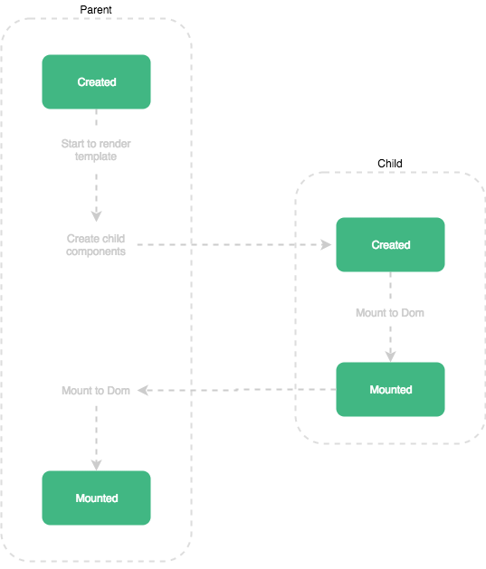

# Vue Parent and Child lifecycle hooks #



<br>

::: tip Важно!!!
`Mounted` не гарантирует что все дочерние компоненты будут уже примонтированы.\
Если необходимо подождать пока не будут отрисованы все дочерние, можно воспользоваться vm.$nextTick внутри mounted:
:::
```ts
async mounted() {
   await this.$nextTick();
   // Код, который будет запущен только после
   // отображения всех представлений
}
```
<br>

1. Parent-компонент **ждет** пока "смонтируется" его childrnen-компоненты и только затем "монтируется" сам
2. После создания  (`created`) компонента-потомка его реактивные свойства и состояние начинают "трекаться", 
   (самое главное !) до того как смонтируется parent-родитель (хук `mounted`)\
   Поэтому следует внимательно осуществлять изменение состояний в хуке `mounted` parent-компонента
3. Также важно, логика может быть измнена, то есть parent-компонент может быть "смонтирован" ранее childrnen-компонентов, если последние являются ассинхронными (компонентами)   